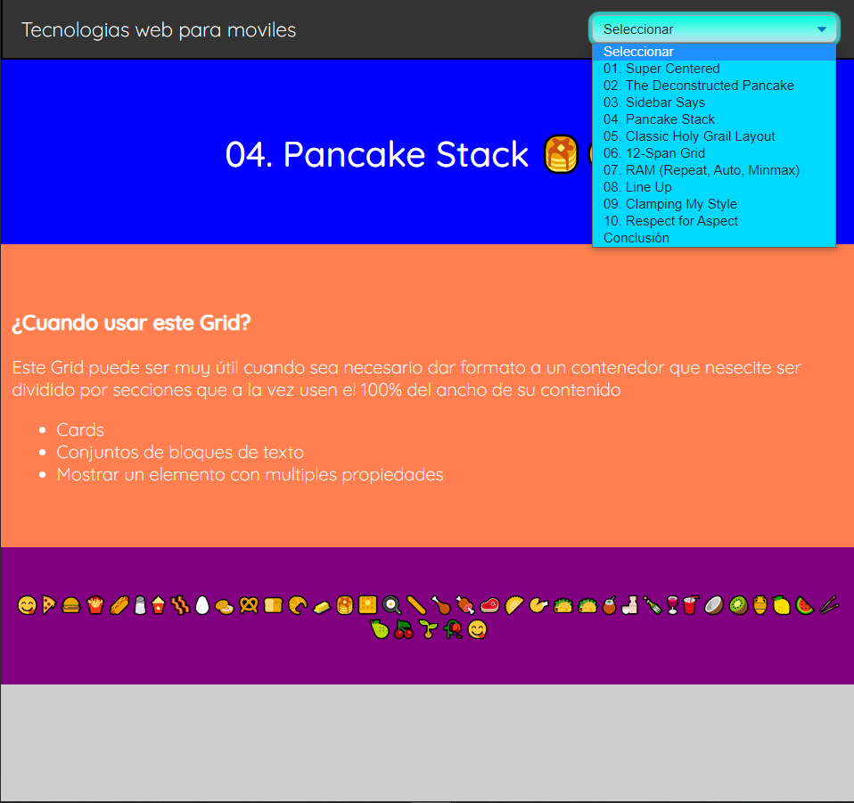

# Casos de usos Grids en CSS y SASS

## Descripci&oacute;n

 

#### En este proyecto de caso de uso de Grids se muestra una lista con algunos de los diferentes estilos que existen para la implementaci&oacute;n de Grids as&iacute; como una descripci&oacute;n de los casos de uso donde se podr&aacute;n usar.

#

### Dominio publico de git pages

https://julio-fernandez.github.io/Grids-Casos-de-uso/

